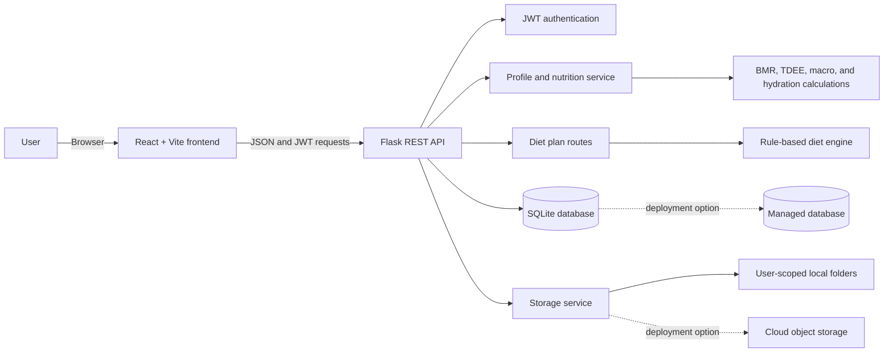

# AI-Powered Personal Diet Planner with Cloud Storage

An AI-assisted personal nutrition planner that combines a React frontend, Flask REST API, JWT authentication, SQLite persistence, a rule-based meal recommendation engine, and user-scoped cloud-storage simulation. This locally runnable Cloud Computing coursework prototype demonstrates how a full-stack application can separate structured data, unstructured files, authentication, and recommendation logic.

> **Project status:** This is a locally runnable academic prototype, not a live cloud deployment. Its current defaults are SQLite, local filesystem uploads, and application-managed JWT authentication. The cloud architectures described in this repository are deployment plans; managed cloud services are not provisioned by the current implementation.

## Author

**Adarsh Srivastav**

Cloud Computing coursework project

## Project Description

NutriCloud AI helps users register, create a health profile, define nutrition goals, and generate custom meal plans based on their preferences and lifestyle. It demonstrates how a real-world web application can integrate authentication, user-specific data storage, API-driven services, and cloud-like file storage into a single project.

The system is designed for accessibility and clarity: users can sign in, update their profile, calculate nutrition targets, generate a plan, review meal recommendations, and manage personal data through a clean dashboard experience. The project is intentionally structured to be functional, testable, and easy to explain during interviews, presentations, and academic evaluation.

## Overview

This project solves a common real-world problem: people struggle to plan meals consistently, keep track of calories and macros, and stay aligned with personal health goals. The app lets a user:

- register and log in securely
- create a health profile
- set a goal like weight loss, maintain, or gain
- generate a personalized diet plan
- save and retrieve plans
- upload and access files in a cloud-storage-style workflow
- view a modern dashboard experience

This project is designed as a beginner-friendly, GitHub-ready cloud project that can be run locally and explained clearly in interviews.

## Problem Statement

People often do not know which foods match their goals, activity level, and dietary preferences. This leads to inconsistent eating habits and poor planning. A cloud-backed app helps centralize user data, personalize plans, and provide access across devices.

## Objectives

- Build a responsive frontend for user interaction
- Implement a backend API with authentication
- Store user data securely and separately per user
- Generate diet recommendations using a local AI rule-based engine
- Simulate cloud storage with user-scoped uploads
- Demonstrate testing, deployment thinking, and GitHub-ready documentation

## Features

- User registration and login
- JWT-based protected routes
- User profile creation and updates
- Nutrition target calculation (BMR/TDEE/macros)
- Automated diet plan generation
- Vegetarian and vegan support
- Goal-specific plan generation
- Plan retrieval and deletion
- File upload and download simulation
- Secure user isolation
- Testing suite for the backend

## User Workflow

```text
User creates an account
  -> User signs in and receives a JWT
  -> User completes a nutrition profile
  -> Backend calculates nutrition targets
  -> AI engine generates meals from profile data and targets
  -> Plan is stored for the authenticated user
  -> User can retrieve plans and manage user-scoped files
```

## Cloud Computing Concepts Demonstrated

This project includes the following concepts:

- Cloud-hosted web app architecture
- Authentication and authorization
- Cloud database simulation using SQLite
- Object storage simulation with local user folders
- REST API communication between frontend and backend
- Client-server architecture
- Data isolation per user
- Scalability and cloud deployment readiness
- Environment-variable-based configuration
- Security basics and validation

## Technology Stack

### Recommended local setup used in this project

- Frontend: React + Vite
- Backend: Python Flask
- Database: SQLite (local cloud-database simulation)
- AI Engine: Rule-based diet recommendation engine
- Storage: Local object storage simulation
- Authentication: JWT
- Testing: Pytest

## System Architecture



The solid paths represent the current local implementation. The dotted paths are possible cloud deployment integrations and are not currently connected services.

## Database Design

| Entity | Purpose |
| --- | --- |
| `users` | Stores user identity, password hash, profile fields, goals, preferences, and completion status. |
| `diet_plans` | Stores generated meals, calories, macronutrients, hydration reminders, diet type, goal, and owner ID. |
| `user_files` | Stores uploaded-file metadata, owner ID, original filename, storage path, size, and type. |

The database stores file metadata while uploaded file contents remain in the user-scoped storage directory. This demonstrates the difference between structured database records and unstructured object data.

## File Storage

The active storage service saves uploaded files under a user-specific directory inside `backend/uploads/`. Each upload receives a generated file ID and a secured stored filename. The database records the original filename and storage metadata.

The storage routes enforce ownership when listing, downloading, and deleting files. For production, this service boundary can be replaced with private Amazon S3, Azure Blob Storage, Google Cloud Storage, or Firebase Storage using authorized or signed download URLs.

## Authentication and Authorization

- Registration validates the name, email, and password before creating a user.
- Passwords are stored as hashes rather than plaintext values.
- Login returns a signed JWT and basic user information.
- Protected endpoints require a valid Bearer token.
- Profile, plan, and file operations use the authenticated user ID.
- Plan and file retrieval prevents one user from accessing another user's records.
- Logout acknowledges the request; because JWT is stateless, the client removes its stored token.

## Screenshots

The `screenshots/` folder contains evidence of the application workflow, responsive layout, automated tests, architecture, and GitHub presentation.

| Screenshot | Demonstrates |
| --- | --- |
| [Landing page](screenshots/01_landing_page.png) | Project branding, purpose, and main call to action. |
| [Landing features](screenshots/02_landing_features.png) | AI planning, cloud storage, security, and platform capabilities. |
| [Registration page](screenshots/03_registration_page.png) | New-user account creation workflow. |
| [Login page](screenshots/04_login_page.png) | Returning-user authentication workflow. |
| [Completed profile](screenshots/05_completed_profile.png) | Profile data used by nutrition calculations. |
| [Nutrition targets](screenshots/06_nutrition_targets.png) | BMR, TDEE, calories, macros, and hydration targets. |
| [Plan configuration](screenshots/07_plan_configuration.png) | Diet type, goal, plan name, and generation controls. |
| [Generated diet plan](screenshots/08_generated_diet_plan.png) | Breakfast, lunch, snack, dinner, and food-level recommendations. |
| [Nutrition summary](screenshots/09_nutrition_summary.png) | Total calories, macros, hydration reminder, and disclaimer. |
| [Responsive mobile view](screenshots/10_responsive_mobile_view.png) | Usability on a mobile viewport. |
| [Backend test results](screenshots/11_backend_test_results.png) | Successful automated backend test execution. |
| [System architecture](screenshots/12_system_architecture.png) | Relationship between frontend, API, AI, database, and storage. |
| [GitHub project overview](screenshots/13_github_project_overview.png) | Repository presentation and documentation. |

Application screenshots show the local prototype. They do not represent a live hosted cloud deployment or clinical nutrition service.

## Folder Structure

```
AI-Powered-Personal-Diet-Planner-with-Cloud-Storage/
├── ai_engine/
│   ├── diet_engine.py
│   └── food_data.json
├── backend/
│   ├── app.py
│   ├── models/
│   ├── requirements.txt
│   ├── routes/
│   ├── services/
│   └── utils/
├── cloud/
│   ├── database_service.py
│   └── storage_service.py
├── docs/
│   ├── architecture.md
│   ├── deployment.md
│   ├── final-academic-submission.md
│   ├── project-report.md
│   ├── requirements-checklist.md
│   ├── submission-summary.md
│   ├── testing.md
│   ├── viva-script.md
│   └── interview-prep.md
├── frontend/
│   ├── package.json
│   ├── src/
│   ├── public/
│   └── vite.config.js
├── screenshots/
├── sample_data/
├── tests/
│   └── test_app.py
├── .env.example
├── .gitignore
├── README.md
└── requirements.txt
```

## Installation

### Prerequisites

- Python 3.11 or newer.
- Node.js and npm.
- Git, if cloning the repository.

## Environment Variables

Create a local `.env` file from `.env.example` and set a strong secret for non-demo use.

| Variable | Purpose | Local default |
| --- | --- | --- |
| `SECRET_KEY` | Flask application secret. | Development fallback in code. |
| `PORT` | Backend listening port. | `5000` |
| `FLASK_ENV` | Selects development behavior. | `development` |

Do not commit real secrets, tokens, passwords, or private user data to GitHub.

## Local Setup

From the project root in Windows PowerShell:

```powershell
python -m venv .venv
.\.venv\Scripts\Activate.ps1
python -m pip install -r requirements.txt
python -m pip install pytest
Set-Location frontend
npm install
Set-Location ..
```

If PowerShell activation is unavailable, use the virtual environment executable directly:

```powershell
.\.venv\Scripts\python.exe -m pip install -r requirements.txt
.\.venv\Scripts\python.exe -m pip install pytest
```

## Running the Application

Start the backend in one terminal:

```powershell
Set-Location backend
python app.py
```

The API runs at `http://localhost:5000` and its health endpoint is `http://localhost:5000/api/health`.

Start the React frontend in a second terminal:

```powershell
Set-Location frontend
npm run dev -- --host 0.0.0.0
```

Open the frontend at `http://localhost:5173`.

The backend must be running for registration, login, profile saving, plan generation, and storage operations.

## API Reference

All API routes are served by Flask. Protected routes require `Authorization: Bearer <token>`.

| Method | Endpoint | Purpose |
| --- | --- | --- |
| `GET` | `/api/health` | Health check for the backend service. |
| `POST` | `/api/auth/register` | Create a user account and return a JWT. |
| `POST` | `/api/auth/login` | Authenticate a user and return a JWT. |
| `POST` | `/api/auth/logout` | Acknowledge client-side logout. |
| `GET` | `/api/auth/me` | Return the current authenticated user. |
| `GET` | `/api/profile` | Read the authenticated user's profile. |
| `PUT` | `/api/profile` | Create or update profile information. |
| `GET` | `/api/profile/targets` | Calculate and return nutrition targets. |
| `POST` | `/api/plans/generate` | Generate and save a personalized diet plan. |
| `GET` | `/api/plans` | List plans belonging to the authenticated user. |
| `GET` | `/api/plans/<plan_id>` | Read one owner-authorized diet plan. |
| `DELETE` | `/api/plans/<plan_id>` | Delete one owner-authorized diet plan. |
| `POST` | `/api/storage/upload` | Upload an allowed file for the current user. |
| `GET` | `/api/storage/files` | List files belonging to the current user. |
| `GET` | `/api/storage/files/<file_id>/download` | Download an owner-authorized file. |
| `DELETE` | `/api/storage/files/<file_id>` | Delete an owner-authorized file. |

## AI Recommendation Approach

This project uses a rule-based recommendation engine for meal generation. It evaluates:

- dietary preference
- calories and macros
- allergies
- goal type
- general health/wellness preference

It deliberately avoids medical claims and labels outputs as educational/demo wellness guidance.

## Testing

The automated backend suite is in:

- `tests/test_app.py`

Run the suite from the `backend` directory:

```powershell
Set-Location backend
..\.venv\Scripts\python.exe -m pytest ..\tests\test_app.py -q
```

A verified local run reports:

```text
27 passed
```

## Security and Data Privacy

The project follows basic security principles:

- user authentication via JWT
- user-specific data access
- input validation
- protected routes
- no credentials stored in source files
- environment variables for secrets

## Cloud Deployment Plan

The repository is structured so local services can later be replaced with managed cloud services:

1. Host the React frontend on a static hosting platform or production web service.
2. Run the Flask API with a production WSGI server or container platform.
3. Replace SQLite with a managed relational database such as PostgreSQL.
4. Replace local uploads with private object storage such as Amazon S3, Azure Blob Storage, Google Cloud Storage, or Firebase Storage.
5. Store secrets in a provider-managed secret manager.
6. Configure HTTPS, restricted CORS, monitoring, backups, and access policies.

This is a deployment plan, not a claim that the current repository is already deployed or connected to those services.

## Disclaimer

This project is for educational and general wellness demonstration. Generated diet plans are not medical advice and should not replace professional nutrition or clinical guidance.

## Limitations

- The current database is SQLite for local development and testing.
- Uploaded files use local filesystem storage rather than durable object storage.
- The recommendation engine is rule-based and not a medical AI system.
- No managed cloud database, cloud storage adapter, hosted identity provider, CI/CD pipeline, or production deployment is configured.
- Browser end-to-end, load, accessibility, and security audits are outside the current automated test suite.

## Future Scope

- Add a managed PostgreSQL database and migration workflow.
- Implement provider-backed private object storage with signed downloads.
- Add chart-based nutrition history and plan comparison.
- Add browser end-to-end and accessibility testing.
- Add CI checks for frontend build, backend tests, linting, and security scanning.
- Integrate an optional external AI provider with a deterministic local fallback.
- Add production identity management, refresh-token handling, rate limiting, and observability.

## License

This project is for educational use.
